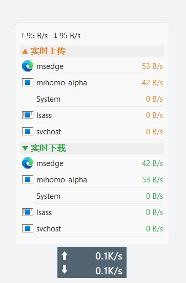
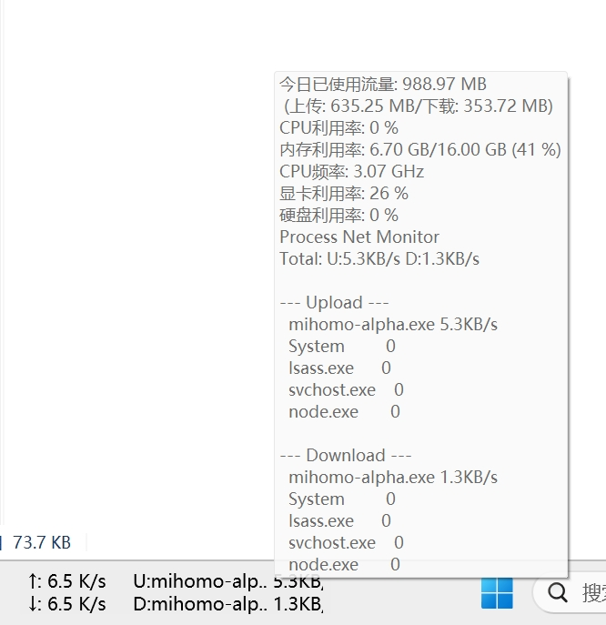
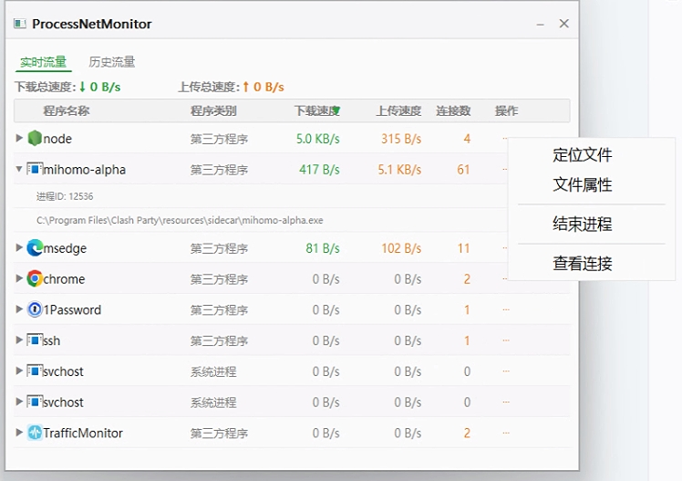
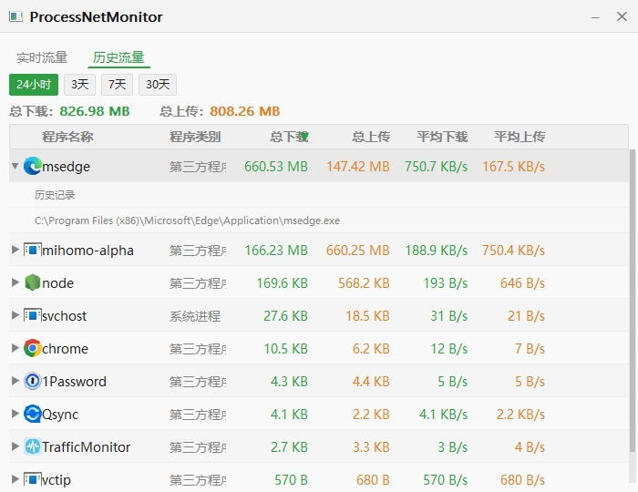

# ProcessNetMonitor - TrafficMonitor 插件

[TrafficMonitor](https://github.com/zhongyang219/TrafficMonitor) 的插件，显示每个进程的网络速度。

## 效果预览









## 功能

- **任务栏**：两行显示，Upload 和 Download 各一行
  ```
  U:mihomo-alp. 5.6KB/s
  D:mihomo-alp. 1.4KB/s
  ```
- **透明区域**（可选显示项目）：任务栏上完全不可见，点击弹出悬浮信息窗口
  - 默认宽度 100px，插件「选项」中可自定义（0~500px）
  - 适合只想使用 TM 自带速度显示的用户
- **悬浮信息窗口**：鼠标悬停主悬浮窗或点击任务栏插件区域时弹出带进程图标的详情窗口
  - 进程图标 + 名称 + 上传/下载速度
  - 深色/浅色主题跟随系统设置
  - 上传/下载各显示 Top 5 进程
  - 空闲进程按 EMA（指数移动平均）排序，展示近期活跃进程
  - 圆角窗口，DWM 阴影
  - 任务栏点击弹出后，鼠标在悬浮窗或任务栏上均保持显示
- **详情窗口**（点击插件区域打开）：
  - 实时流量：可排序表格，显示进程名 / 类别 / 下载速度 / 上传速度 / 连接数
  - 历史流量：按时间段（24小时/3天/7天/30天）统计每进程总流量和平均速度
  - 展开行：火绒风格，点击进程名展开显示子进程 PID / 路径 / 连接详情表（协议/本地地址/远程地址/状态）
  - 连接状态颜色编码：绿=ESTABLISHED, 蓝=LISTENING, 橙=TIME_WAIT, 深橙=CLOSE_WAIT
  - 多进程合并：Chrome 等多进程软件按名称合并为一行，展开后显示各子进程
  - 右键菜单：定位文件 / 文件属性 / 结束进程
  - 历史数据持久化：关闭重启后历史数据不丢失
  - 排序状态持久化：排序设置保存到文件，TM 重启后恢复
- **高 DPI 支持**：适配 150%/175%/200% 等系统缩放，跟随显示器 DPI 变化自动调整
- **自定义图标**：详情窗口标题栏显示插件专属图标
- **可拖拽滚动条**：自绘滚动条支持鼠标拖拽、点击翻页、滚轮滚动
- **不显示系统速度**：系统速度由 TrafficMonitor 本身提供，插件只显示进程级信息
- **右键隐藏**：任务栏插件区域右键即可隐藏悬浮信息窗口

## 流量统计原理

### TCP 流量
使用 `GetPerTcpConnectionEStats` API 直接从 TCP 协议栈内核读取每条连接的 `DataBytesIn` / `DataBytesOut` 累计值，按 PID 聚合后计算 delta 得到速度。

**优势**：
- 不依赖网卡抓包，WLAN/以太网/VPN 均可正常工作
- 双向流量均准确（解决了 raw socket 在 WLAN 上无法捕获入站包的问题）
- 自动跳过 loopback 连接（127.0.0.1），避免代理软件流量双重计算

### UDP 流量
使用 raw socket（`SIO_RCVALL`）抓包，通过 UDP 端口到 PID 的映射表匹配进程。

### 网卡选择
跟随 TrafficMonitor 的网卡设置（自动选择/选择全部/指定网卡），每 5 秒检测配置变化并自动切换。

## 编译环境

- **编译器**：MSVC 14.44.35207 (Visual Studio 2022 BuildTools)
- **SDK**：Windows SDK 10.0.26100.0
- **C++ 标准**：C++17
- **依赖库**：iphlpapi.lib, ws2_32.lib, gdi32.lib, user32.lib, shell32.lib, dwmapi.lib, advapi32.lib

## 编译部署

```bat
:: 编译 64 位（默认）
build.bat x64

:: 编译 32 位
build.bat x86

:: 编译两个架构
build.bat all
```

build.bat 会自动：编译 → 杀 TM → 复制 DLL → 启动 TM

**注意**：如果 TM 以管理员权限运行，build.bat 用 WMI `Win32_Process.Terminate` 来杀进程，无需手动提权。

## 文件结构

```
ProcessNetMonitor/
├── build.bat                    # 编译+部署脚本（支持 x86/x64/all）
├── plugin/
│   ├── src/
│   │   ├── PluginInterface.h    # TM 插件接口定义
│   │   ├── capture.h / .cpp     # 流量采集（GetPerTcpConnectionEStats + raw socket）
│   │   ├── plugin_main.h / .cpp # 插件主体（3个item：Up/Down/透明区域）
│   │   ├── tooltip_popup.h/.cpp # 富文本悬浮信息窗口
│   │   ├── detail_window.h/.cpp # 火绒风格详情窗口
│   │   ├── resource.rc          # 资源文件（图标）
│   │   ├── app.ico              # 插件图标
│   ├── ProcessNetMonitor.dll         # 64 位编译输出
│   ├── ProcessNetMonitor_x86.dll     # 32 位编译输出
│   ├── ProcessNetMonitor_debug.dll   # 64 位调试版（含日志输出）
├── TrafficMonitor/
│   └── TrafficMonitor/          # TM 主程序
│       └── plugins/             # 插件DLL放这里
└── README.md
```

## TM 配置

1. 打开 TM → 右键 → 选项 → 插件
2. 勾选 "Up"、"Down" 和 "透明区域"（可选）显示项目
3. 在任务栏设置中将需要的项目添加到任务栏显示

**推荐设置**：选项 → 主窗口设置 → 取消勾选「显示鼠标提示」，否则主悬浮窗鼠标悬停时会同时出现两个信息窗口（TM 自带的文本提示 + 本插件的富文本弹窗）

## 数据存储

- **历史流量**：`%APPDATA%\TrafficMonitor\plugins\ProcessNetMonitor\history.dat`（非 portable 模式）或 `<exe_dir>\plugins\ProcessNetMonitor\history.dat`（portable 模式）
- **排序设置**：同目录下 `settings.json`
- 数据格式版本 v4，自动兼容 v2/v3 旧格式

## 版本历史

### v1.8.1 (2026-07-24)
- **修复任务栏错误提示乱码**：未以管理员身份运行 TrafficMonitor 时，任务栏原先显示被截断成天书的英文错误（用户反馈的 "ERR: RRW SOOKET FAILE"），现改为简短中文提示 `ERR: 需要管理员权限`
- **错误信息细分**：区分权限不足（WSAEACCES 10013）、网卡绑定失败、抓包被拒（SIO_RCVALL）、无可用网卡四种情况；鼠标悬停任务栏插件时显示详细错误说明和解决方法
- **修复重试死锁 bug**：此前套接字创建失败后 bind key 已提前提交，导致插件永远不会重试、瞬态失败变永久失败；现在失败后每 10 秒自动重试一次，权限或网卡恢复后自动恢复正常
- **启动重试节流**：失败时不再每秒重复执行 WSAStartup + 网卡枚举，改为每 10 秒一次
- **新增诊断日志**：插件配置目录（`%APPDATA%\TrafficMonitor\plugins\ProcessNetMonitor`）自动生成 `capture.log`，记录网卡选择结果和启动失败原因，方便远程排查

### v1.8.0 (2026-07-11)
- **新增「透明区域」显示项目**：插件新增第三个显示项目「透明区域」，在任务栏上完全不可见，但点击即可弹出悬浮信息窗口。适合只想使用 TM 自带速度显示、但又想点击弹出详情的用户
  - 在 TM 插件管理中勾选「透明区域」即可启用
  - 默认宽度 100px，在插件「选项」中可自定义（0~500px），实时生效
  - Up/Down 项目保持正常显示，不受影响
- **历史流量一键清除**：历史流量 tab 时间范围按钮右侧新增红色「清除数据」按钮，点击确认后清除所有历史流量数据并删除 history.dat 文件
- **右键隐藏**：任务栏上右键即可隐藏悬浮信息窗口

### v1.7.0 (2026-07-10)
- **任务栏点击弹出悬浮信息窗口**：点击任务栏插件区域即可弹出与主窗口悬停相同的进程详情悬浮窗
- **任务栏悬浮窗持久化**：点击任务栏弹出的悬浮窗，鼠标在悬浮窗或任务栏上均保持显示，离开两者后才消失
- **修复任务栏悬浮窗误弹**：鼠标悬停任务栏 TM 区域时，不再在主窗口误弹悬浮信息窗口（修复 `#32770` 对话框 parent chain 误判问题）
- **新增 debug 版本**：Release 附带 `ProcessNetMonitor_debug.dll`，内置调试日志输出，遇到问题时替换即可采集日志

### v1.6.2 (2026-07-09)
- **新增 TUN 设置界面**：在 TM 插件管理中点击"选项"即可弹出设置窗口，可视化编辑 TUN 地址段，无需手动改 JSON 文件
- 支持多行 CIDR，每行一个网段，点 OK 即时保存生效

### v1.6.1 (2026-07-09)
- **设置文件改为 JSON 格式**：`settings.dat` → `settings.json`，可读性好，方便手动编辑
- **TUN 地址段可配置**：在 `settings.json` 中编辑 `tun_ranges` 数组即可自定义跳过的 TUN 网段，默认 `["198.18.0.0/15"]`，适配不同代理软件的 TUN 配置

### v1.6.0 (2026-07-09)
- **修复 TUN 代理模式流量双重计算**：跳过 `198.18.0.0/15`（TUN fake IP 段）的 TCP 连接，避免 Edge/xray 等应用经 TUN 网卡的连接与 mihomo 出站连接被重复统计。TUN 模式下流量总量现在与网卡实际收发一致
- **修复 UDP 流量丢失**：TCP 和 UDP 统计分离追踪（`m_udp_cum`/`m_udp_prev`），不再用 TCP 覆盖 UDP。DNS/QUIC/Hysteria 等 UDP 流量现在正确计入
- **修复历史流量虚高 Bug**：当 TCP 连接关闭导致累计值下降时，错误地将剩余连接的全部累计字节记为新流量。现修正为 clamp 到 0
- **修正插件版本号**：v1.5.0 时漏更 `TMI_VERSION`，之前一直显示 1.3.0

### v1.5.0 (2026-07-06)
- **TCP 流量统计改用 `GetPerTcpConnectionEStats` API**：直接从内核 TCP 协议栈读取每连接字节数，彻底解决 raw socket 在 WLAN 上无法捕获入站流量的问题
- **跳过 loopback 连接**：避免代理软件（如 mihomo/clash）导致的流量双重计算
- **展开行显示连接详情**（火绒风格）：协议/本地地址/远程地址/状态，带颜色编码
- **多进程合并**：Chrome 等多进程软件按名称合并为一行，展开后显示各子进程
- **高 DPI 适配**：支持 150%/175%/200% 等系统缩放，`WM_DPICHANGED` 自动响应
- **自定义窗口图标**：详情窗口标题栏显示插件专属图标
- **可拖拽滚动条**：自绘滚动条支持鼠标拖拽、点击翻页
- **排序状态持久化**：保存到 `settings.dat`
- **历史流量基线修复**：首次见到进程时 delta=0，不把已有累计值误记为新流量
- **历史流量多进程聚合**：`RecordHistory` 先按名称聚合再算 delta，避免多 PID 虚高
- **跟随 TM 网卡设置**：自动选择/选择全部/指定网卡，每 5 秒检测配置变化
- **auto 模式跳过虚拟网卡**：TUN/TAP/mihomo/clash/vpn/wireguard 等自动跳过
- **32 位和 64 位构建支持**：`build.bat x86` / `build.bat x64` / `build.bat all`

### v1.4.0 (2026-07-06)
- 历史流量功能完善：数据持久化，关闭重启后不丢失
- 历史数据改用墙钟时间戳（不再依赖系统运行时长），重启电脑后数据依然有效
- 存储格式改为增量记录（每次采样的实际传输量），彻底解决 TM 重启后累计值归零导致数据清零的问题
- 展开行状态修复：历史标签页切换时间范围或数据刷新时，已展开的行不再自动折叠
- 自动保存间隔从 60 秒缩短到 30 秒
- 数据文件版本升级至 v4，自动兼容旧格式（v2/v3）

### v1.3.0 (2026-07-05)
- 新增「详情窗口」：点击插件区域打开火绒风格的全功能流量监控窗口
- 可排序表格：程序名称 / 程序类别 / 下载速度 / 上传速度 / 连接数
- 进程图标 + 进程名 + .exe 自动去除
- 展开行：显示进程 ID 和完整路径
- 右键菜单：定位文件 / 文件属性 / 结束进程
- 标题栏可拖动，Esc 关闭
- 实时/历史标签页（UI 骨架，历史功能待实现）
- 连接数统计：从 TCP 连接表实时统计每进程活跃连接数
- 深色/浅色主题跟随系统

### v1.2.0 (2026-07-05)
- 新增 Rich Tooltip Popup：鼠标悬停主悬浮窗时弹出带进程图标的详情窗口
- 深色/浅色主题跟随系统设置
- 上传/下载各显示 Top 5 进程（不够时用历史进程补位）
- EMA 指数移动平均排序（alpha=0.3，~30 秒衰减窗口）
- 进程图标缓存（SHGetFileInfo + ExtractAssociatedIcon）
- 分层窗口 + DWM 圆角 + SetWindowRgn 裁黑角
- 智能 hover 检测：GetAncestor(GA_ROOT) + 任务栏位置判断，区分主悬浮窗和任务栏窗口
- 自适应高度（根据实际进程数调整）
- hover 检测频率优化：显示时 80ms，隐藏时 300ms

### v1.1.0 (2026-07-05)
- 从单 item (CustomDraw) 改为双 item（Up/Down 独立显示）
- 去掉任务栏系统速度（TM 自带）
- 去掉任务栏标签文字
- 恢复 tooltip 完整进程列表

### v1.0.0
- 初始版本，单 item CustomDraw 模式
- 支持按进程统计网络速度（Upload/Download Top 5）
